# 零散知识(学习自代码)

- [零散知识(学习自代码)](#零散知识学习自代码)
  - [isinstance() 类型检查 利器](#isinstance-类型检查-利器)
  - [getattr() 返回对象属性值](#getattr-返回对象属性值)
  - [迭代器](#迭代器)
    - [`__next__()` 返回下一个元素](#__next__-返回下一个元素)
  - [切片\[ start : stop : step \] 区别torch optimizer.step()更新](#切片-start--stop--step--区别torch-optimizerstep更新)
    - [省略step](#省略step)
      - [负数](#负数)
  - [clip\_grad\_norm\_](#clip_grad_norm_)
  - [distributedsampler(多卡训练使用，避免数据顺序读取)](#distributedsampler多卡训练使用避免数据顺序读取)
  - [os.getcwd() 返回当前的工作路径](#osgetcwd-返回当前的工作路径)
  - [logging.getLogger(参数)](#logginggetlogger参数)
  - [.modules()](#modules)
  - [filter lamabda](#filter-lamabda)
  - [优化器构建，感觉也会是公式化的](#优化器构建感觉也会是公式化的)
  - [不懂的语法 列表+字典+](#不懂的语法-列表字典)
  - [enumerate(iteration, start)](#enumerateiteration-start)
  - [/  //  %](#----)
  - [state\_dict](#state_dict)
  - [PyTorch内置学习率调度器(lr\_scheduler)](#pytorch内置学习率调度器lr_scheduler)
  - ['string{}'.format()](#stringformat)
  - [tb\_writer.add\_scalar()](#tb_writeradd_scalar)
    - [1.创建TensorBoard写入器](#1创建tensorboard写入器)
  - [nn.Upsample()](#nnupsample)
  - [torch.nn.functional 常F](#torchnnfunctional-常f)
  - [torch.stack(\[...\])](#torchstack)
  - [torch.FloatTensor() .fill\_(source\_label)](#torchfloattensor-fill_source_label)
  - [nn.DataParallel()](#nndataparallel)
  - [os.path.realpath(__file__): 获取当前脚本的绝对路径](#ospathrealpathfile-获取当前脚本的绝对路径)
  - [np.float 弃用了以前的用法](#npfloat-弃用了以前的用法)
  - [模型不同模式](#模型不同模式)
  - [python class](#python-class)
    - [\_\_init\_\_方法](#__init__方法)
    - [/\_/_call_\_()](#_call_)
  - [Pytorch保存和加载模型(load和load\_state\_dict)](#pytorch保存和加载模型load和load_state_dict)
  - [卷积](#卷积)
    - [卷积核](#卷积核)
    - [池化](#池化)
    - [全局平均池化](#全局平均池化)
      - [下采样 常用](#下采样-常用)
    - [反卷积](#反卷积)
  - [torch.nn.Conv2d](#torchnnconv2d)
  - [forward](#forward)
  - [torch.cat()](#torchcat)
  - [激活函数](#激活函数)
  - [object](#object)
  - [F.normalize() torch.nn.functional.normalize()](#fnormalize-torchnnfunctionalnormalize)
  - [F.normalize() from torchvision.transforms import functional as F](#fnormalize-from-torchvisiontransforms-import-functional-as-f)
  - [Python中\[-1\]、\[:-1\]、\[::-1\]、\[n::-1\]、\[:,:,0\]、\[…,0\]、\[…,::-1\] 的理解](#python中-1-1-1n-100-1-的理解)

## isinstance() 类型检查 利器
`num = 10`  
`result = isinstance(num, int)`  
`print(result)  # True`  

## getattr() 返回对象属性值

似乎只能对class中元素使用，返回值  
`getattr(a, 'x')`  # 获取属性 x 值  
`getattr(a, 'y', 'None')`  # 获取属性 y 值不存在，但设置了默认值,返回None  
eg1:  
`class Test(object):  
    x = "nihao"  
a = Test()  
getattr(a, 'x') #返回nihao`  
## 迭代器
### `__next__()` 返回下一个元素
使用这个首先要创建迭代器iter，循环会隐式自动使用迭代器  
`string="hello"`  
`ite=iter(string)`#创建迭代器  
`print(ite.__next__())`#从0开始 即h  
`print(ite.__iter__())`#返回迭代器本身，类似指针自身  
`print(ite.__next__())`#e  
下面两个循环**效果相同**  
`for i in string:  
    print(i)`  
`for i in iter(string):  
    print(i)`  
## 切片[ start : stop : step ] 区别torch optimizer.step()更新
示例
`lst = [10,20,30,40,50,60,70,80]`  
#切片为：start=2 , stop=6 , step=1  
`lst2 = lst[2:6:1]`#注意最后一个不输出  
`print(lst2)    #[30, 40, 50, 60]`  
### 省略step
`print(lst[1:6:])`    # [20, 30, 40, 50, 60],默认是1  
`print(lst[1:6])`    # [20, 30, 40, 50, 60],默认是1  
`print(lst[1:6:2])`    # [20, 40, 60]  

`print(lst[:6:1])`    # [10, 20, 30, 40, 50, 60]，默认start 1  
`print(lst[1::2])`    # [20, 40, 60, 80]默认stop最后  

#### 负数
step = -1时，start在后，stop在前时才能切片  
`a[-1:-3:-1]`    # [9, 8]

## clip_grad_norm_

`...`  
`loss = crit(...)`  
`optimizer.zero_grad()`  
`loss.backward()`  
`torch.nn.utils.clip_grad_norm_(parameters=model.parameters(), max_norm=10, norm_type=2)`  
`optimizer.step()`  

## distributedsampler(多卡训练使用，避免数据顺序读取)

## os.getcwd() 返回当前的工作路径
## logging.getLogger(参数)

## .modules()
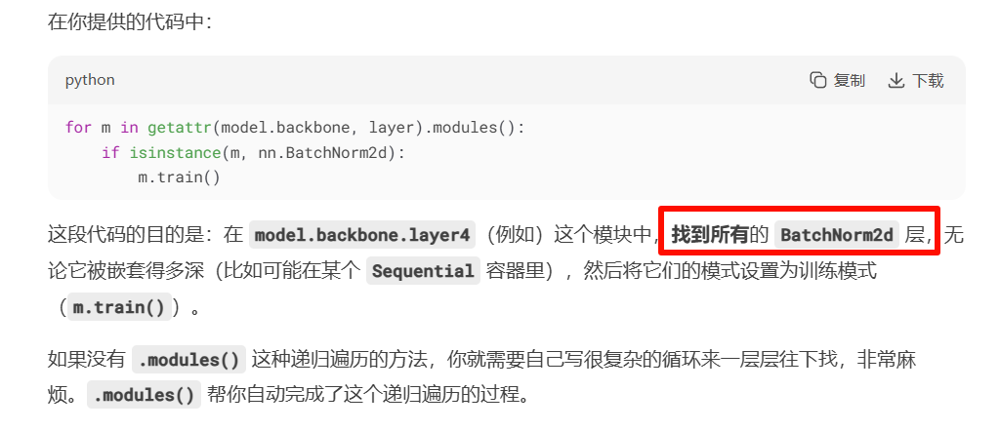
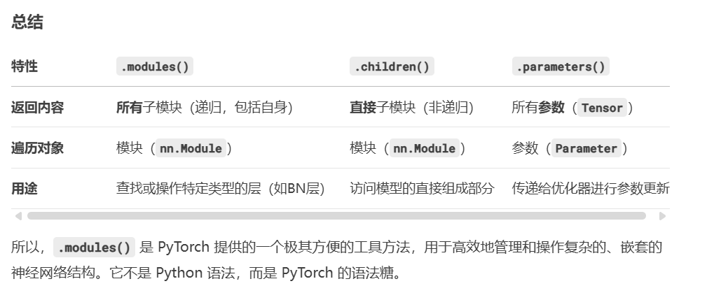

## filter lamabda
这是代码示例，感觉会比较常用
`trainable_params += [{'params': filter(lambda x: x.requires_grad,`  
                                       `model.backbone.parameters()),`  
                      `'lr': cfg.BACKBONE.LAYERS_LR * cfg.TRAIN.BASE_LR}]`  
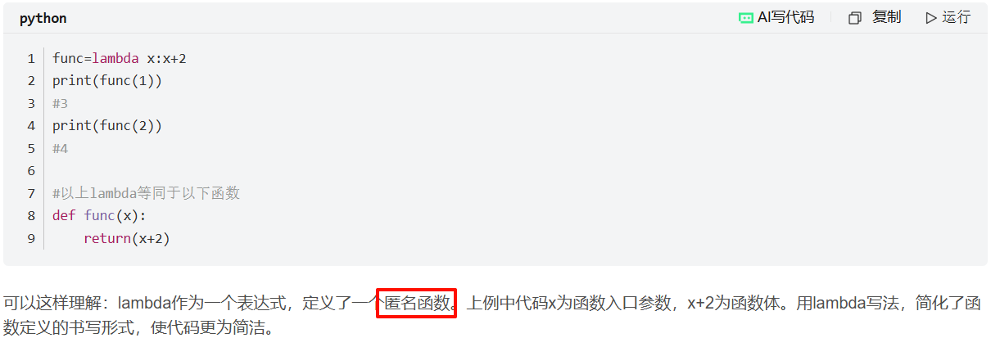
filter(函数，序列)函数用于过滤序列，过滤掉不符合条件的元素，返回由符合条件元素组成的新列表，python返回迭代器
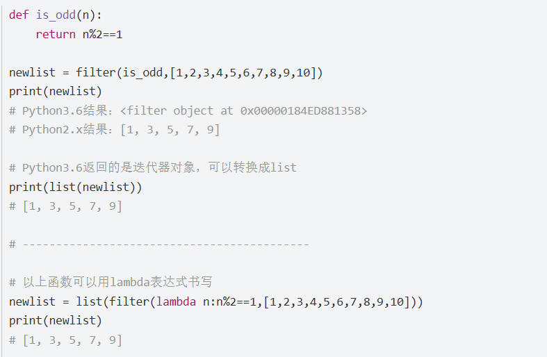

## 优化器构建，感觉也会是公式化的
`optimizer = torch.optim.SGD(trainable_params,`  
                            `momentum=cfg.TRAIN.MOMENTUM,`  
                                                                                `weight_decay=cfg.TRAIN.WEIGHT_DECAY)`  
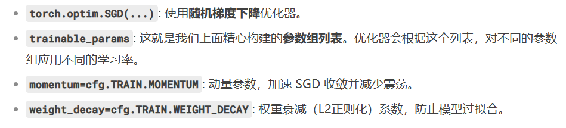

## 不懂的语法 列表+字典+
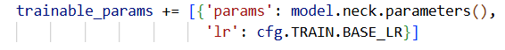
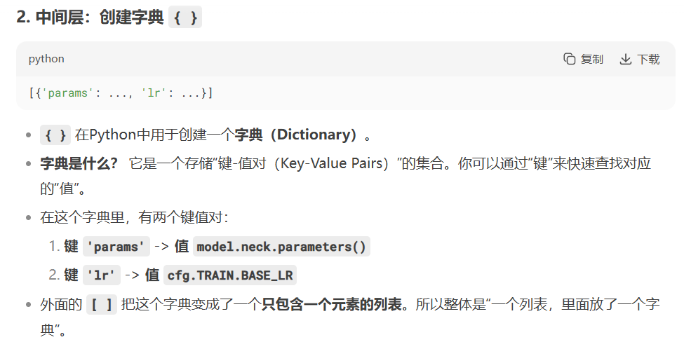
https://blog.csdn.net/ljh18885466426/article/details/119357723

## enumerate(iteration, start)
start默认是0
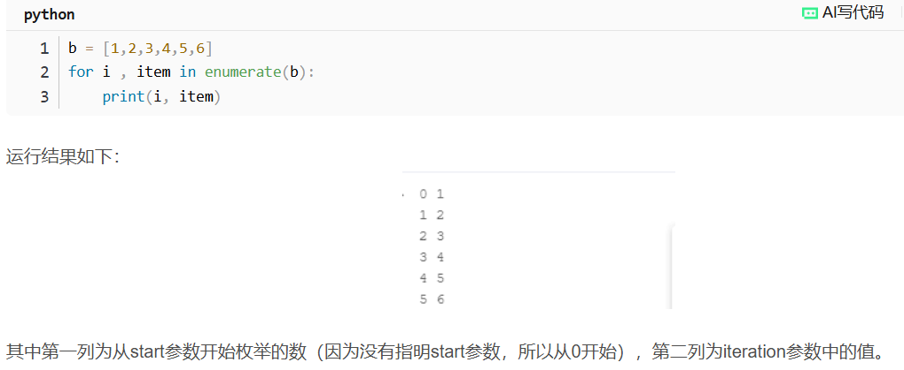

## /  //  %
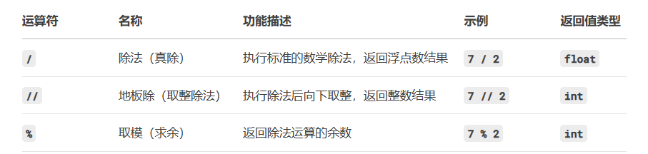

## state_dict
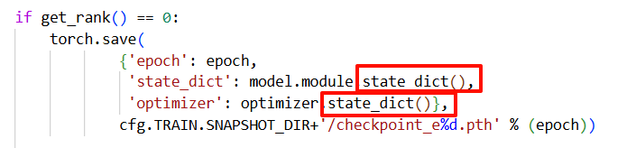
https://www.cnblogs.com/peixu/p/13456971.html

## PyTorch内置学习率调度器(lr_scheduler)
PyTorch学习率调度器 lr_scheduler.step()
scheduler = ... # 定义学习率调度器
scheduler.step() # 更新学习率  # 在每个epoch后更新学习率
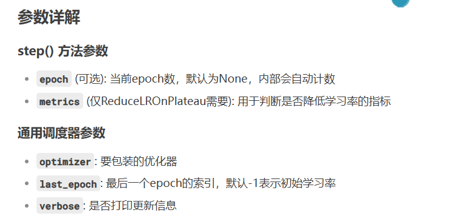
https://zhuanlan.zhihu.com/p/1899093462252520757

## 'string{}'.format()
{}:占位符，format()中的按顺序占位
'epoch {} lr {}'.format(epoch+1, pg['lr'])
eg:
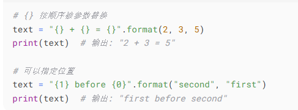
## tb_writer.add_scalar()
### 1.创建TensorBoard写入器
tb_writer = SummaryWriter(log_dir='runs/experiment_1')
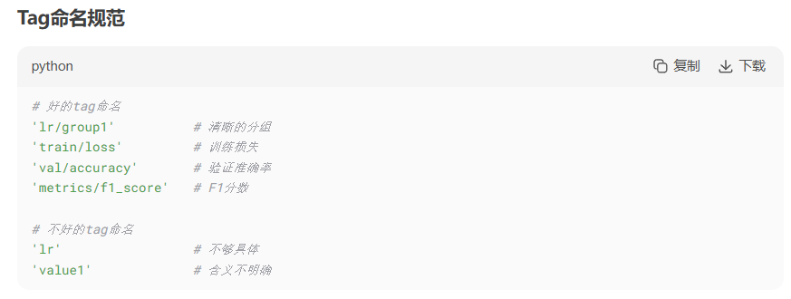

## nn.Upsample()
interp = nn.Upsample(size=(128, 128), mode='bilinear', align_corners=True)#上采样
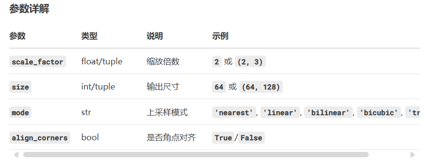

## torch.nn.functional 常F
通常写 import torch.nn.functional as F
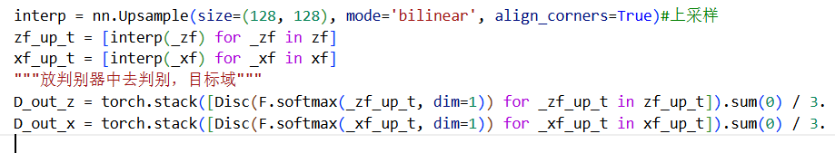
注意这个写法 :[表达式 for 变量 in 可迭代对象],最后返回一个“列表”
F.softmax(x) for x in arr

## torch.stack([...])
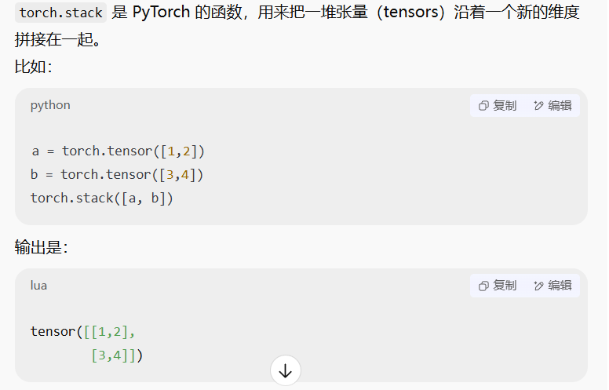
## torch.FloatTensor() .fill_(source_label)
用来创建一个新的浮点数张量（tensor 就是多维数组，可以想象成比 numpy 的 array 更强的矩阵
.fill_() 是张量的方法，可以把整个张量的所有元素都填充成某个数值。
_ 结尾的方法表示它是 原地操作（in-place），即直接修改自己，而不是返回新张量。

## nn.DataParallel()

## os.path.realpath(__file__): 获取当前脚本的绝对路径

## np.float 弃用了以前的用法
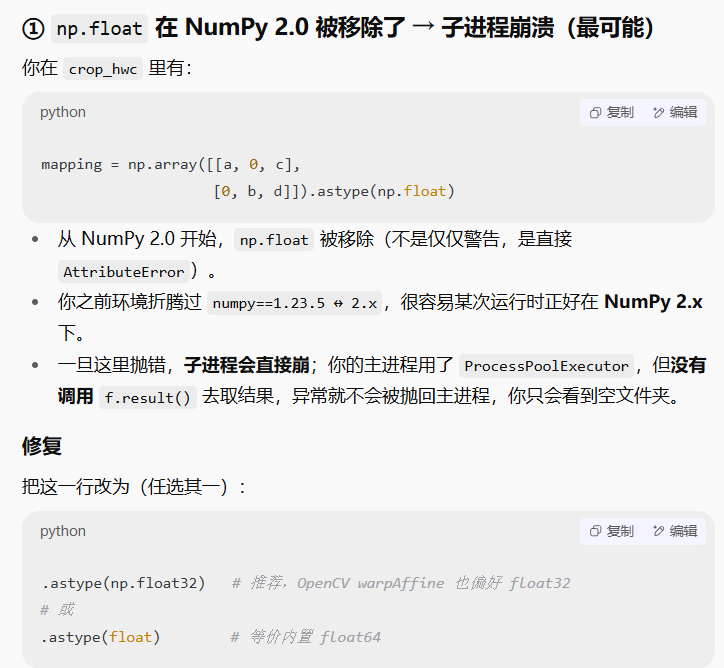

## 模型不同模式
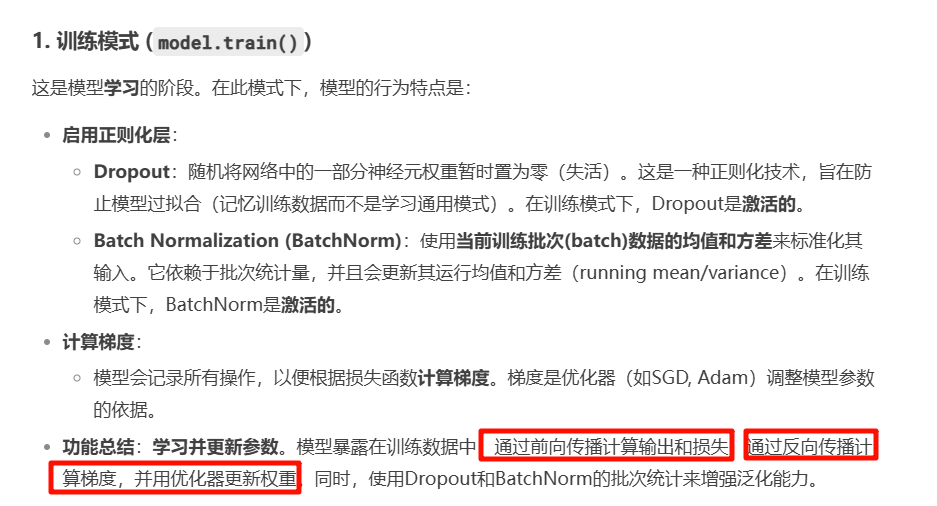
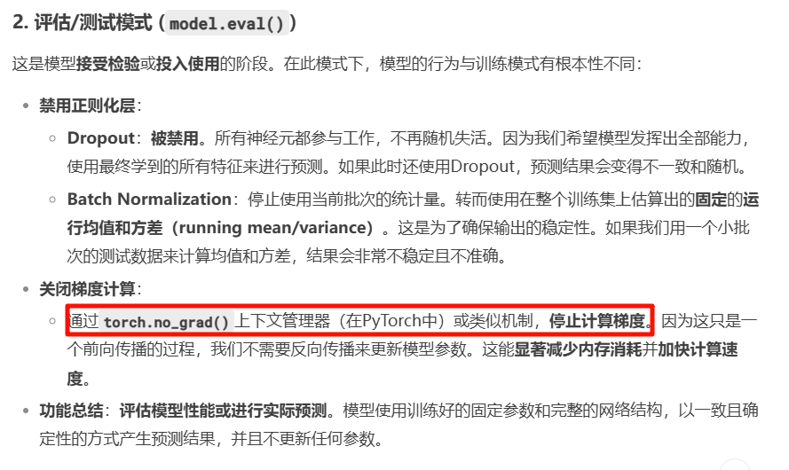
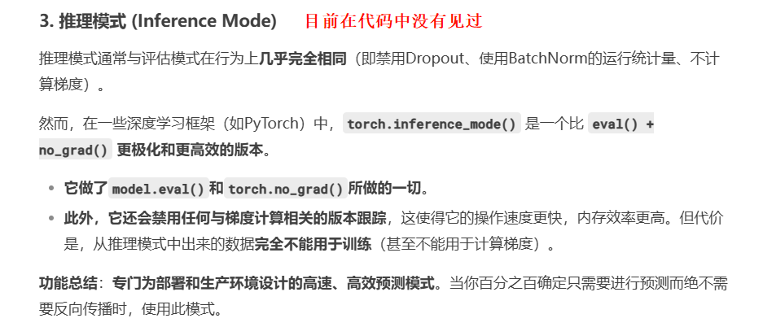

## python class 

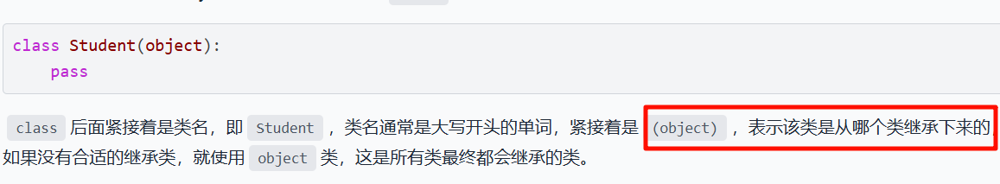
### __init__方法
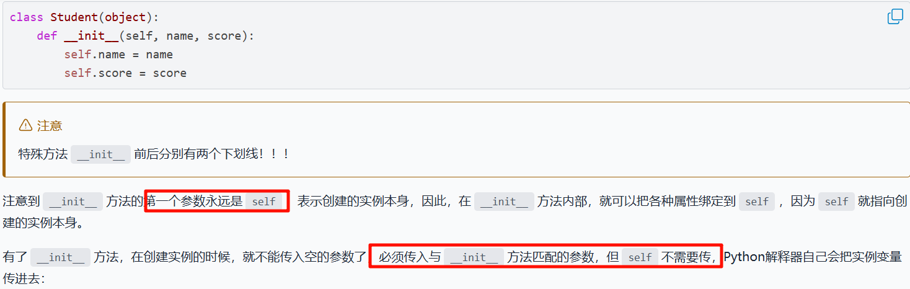

###  /_/_call__()
class的入口 调用实例对象都会先进入这个函数
如果省略，很可能是继承了父类的该函数，一般可能会在其中调用forward()

## Pytorch保存和加载模型(load和load_state_dict)
https://blog.csdn.net/leviopku/article/details/123925804

## 卷积 
### 卷积核
卷积核一般为奇数的正方形，一般为3*3、5*5、
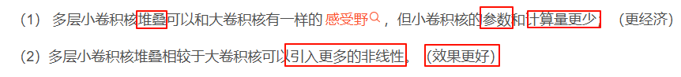

### 池化
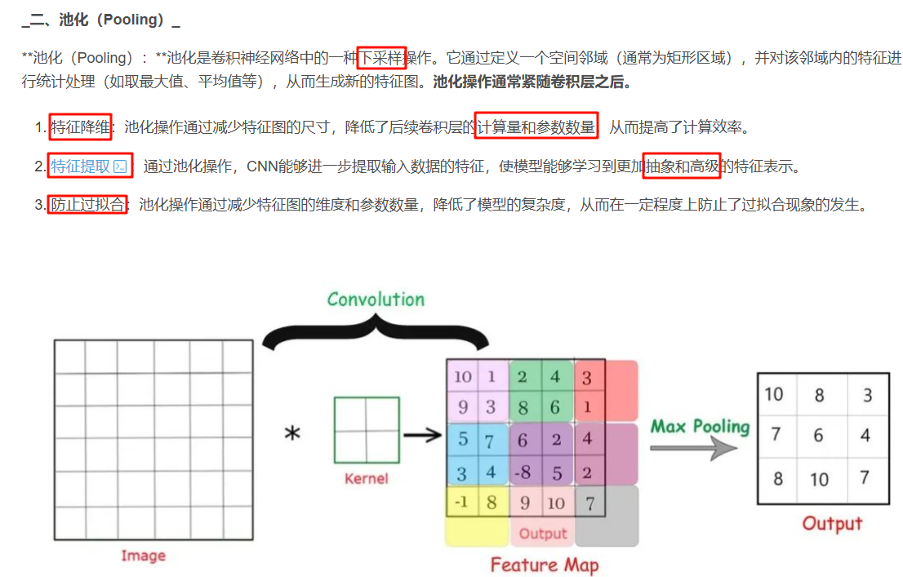

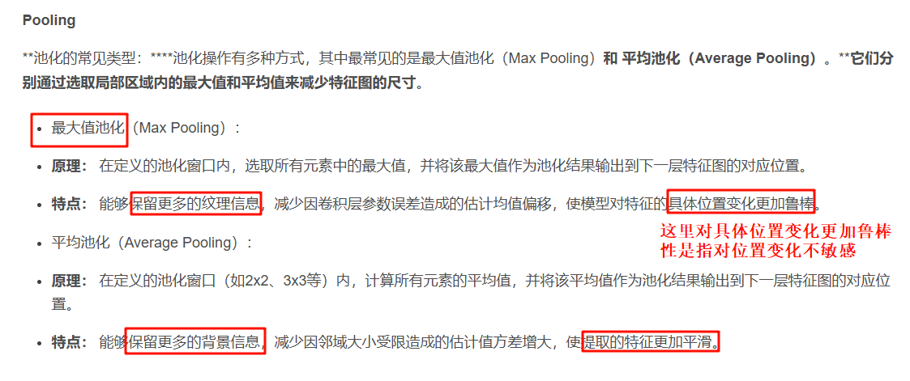
平均池化具有“平滑”或“模糊”效果，可以减少特征图中的噪声和微小变异，使其变化更加平缓。
### 全局平均池化
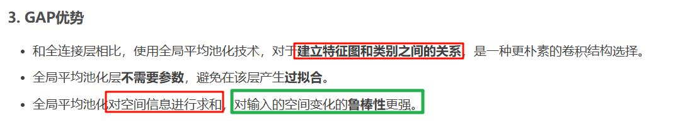

#### 下采样 常用
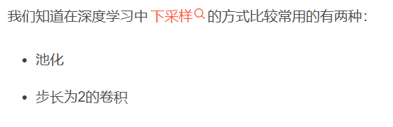
### 反卷积

## torch.nn.Conv2d
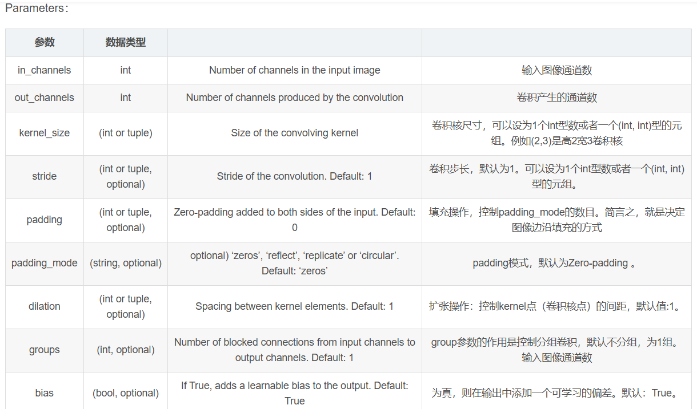

## forward
这个函数是神经网络中用来向前传播的函数，即网络正常向前怎么运行用这个函数控制
在调用的时候不需要写T.forward(6)，直接写T(6)会默认调用forward的方法。
注意要使用import torch.nn as nn

## torch.cat()

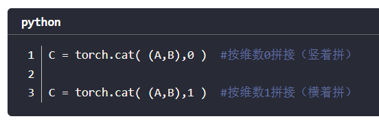

## 激活函数
包含有 Sigmod softmax 
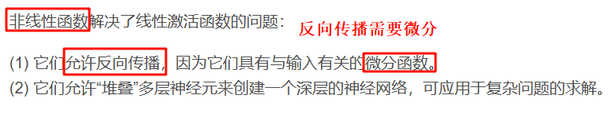
https://blog.csdn.net/dfly_zx/article/details/104493048

## object

## F.normalize() torch.nn.functional.normalize()
torch.nn.functional.normalize(input, p=2.0, dim=1, eps=1e-12, out=None)
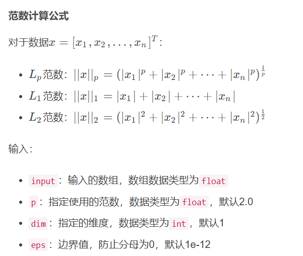
input就是进行归一化的对象,一般将数据限制到0-1之间
一维的时候 整体一组
二维的时候  dim=0 一列为一组  dim=1 一行为一组

## F.normalize() from torchvision.transforms import functional as F 
与上面的函数区分，两个库的同名函数
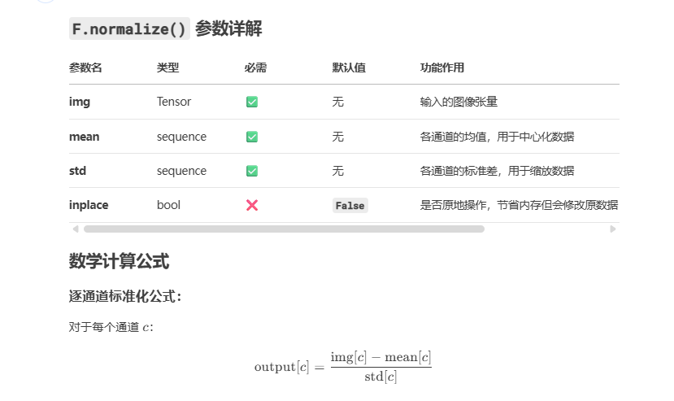
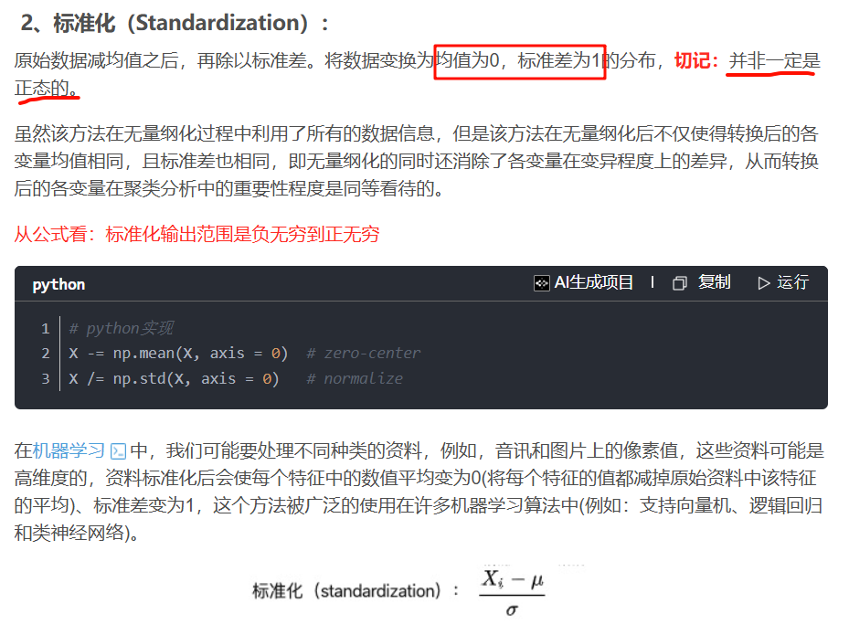

## Python中[-1]、[:-1]、[::-1]、[n::-1]、[:,:,0]、[…,0]、[…,::-1] 的理解

https://blog.csdn.net/weixin_44350337/article/details/116034510
