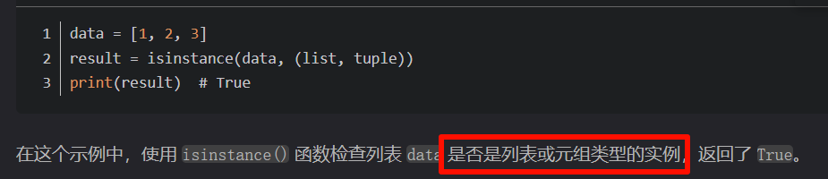
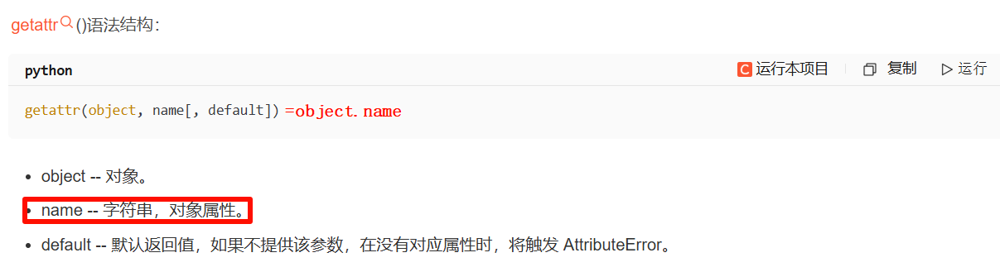
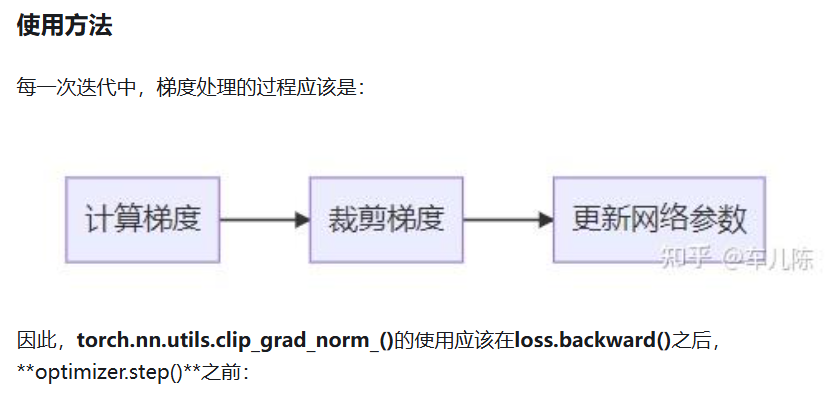
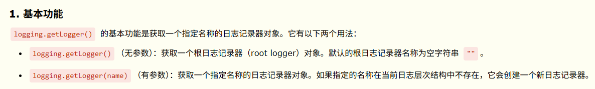

# 零散知识(学习自代码)
## isinstance() 类型检查 利器
`num = 10`  
`result = isinstance(num, int)`  
`print(result)  # True`  

## getattr() 返回对象属性值

似乎只能对class中元素使用，返回值  
`getattr(a, 'x')`  # 获取属性 x 值  
`getattr(a, 'y', 'None')`  # 获取属性 y 值不存在，但设置了默认值,返回None  
eg1:  
`class Test(object):  
    x = "nihao"  
a = Test()  
getattr(a, 'x') #返回nihao`  
## 迭代器
### `__next__()` 返回下一个元素
使用这个首先要创建迭代器iter，循环会隐式自动使用迭代器  
`string="hello"`  
`ite=iter(string)`#创建迭代器  
`print(ite.__next__())`#从0开始 即h  
`print(ite.__iter__())`#返回迭代器本身，类似指针自身  
`print(ite.__next__())`#e  
下面两个循环**效果相同**  
`for i in string:  
    print(i)`  
`for i in iter(string):  
    print(i)`  
## 切片[ start : stop : step ]
示例
`lst = [10,20,30,40,50,60,70,80]`  
#切片为：start=2 , stop=6 , step=1  
`lst2 = lst[2:6:1]`#注意最后一个不输出  
`print(lst2)    #[30, 40, 50, 60]`  
### 省略step
`print(lst[1:6:])`    # [20, 30, 40, 50, 60],默认是1  
`print(lst[1:6])`    # [20, 30, 40, 50, 60],默认是1  
`print(lst[1:6:2])`    # [20, 40, 60]  

`print(lst[:6:1])`    # [10, 20, 30, 40, 50, 60]，默认start 1  
`print(lst[1::2])`    # [20, 40, 60, 80]默认stop最后  

#### 负数
step = -1时，start在后，stop在前时才能切片  
`a[-1:-3:-1]`    # [9, 8]

# clip_grad_norm_

`...`  
`loss = crit(...)`  
`optimizer.zero_grad()`  
`loss.backward()`  
`torch.nn.utils.clip_grad_norm_(parameters=model.parameters(), max_norm=10, norm_type=2)`  
`optimizer.step()`  

# distributedsampler(多卡训练使用，避免数据顺序读取)

# os.getcwd() 返回当前的工作路径
# logging.getLogger(参数)

