# 总结论文中遇到的损失函数

## focal loss
Focal Loss处理正负极样本不平衡
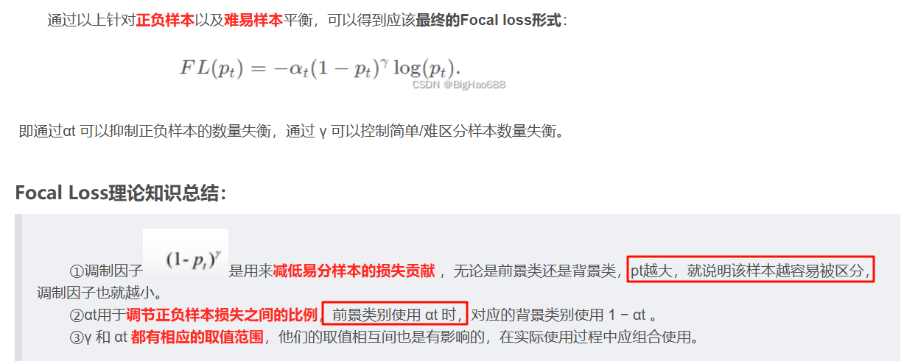
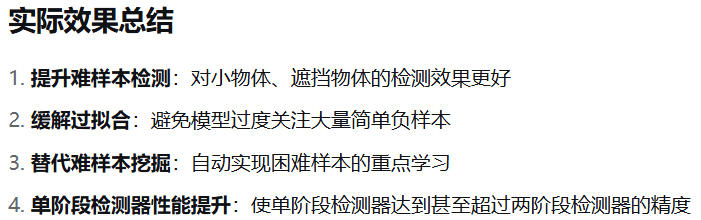

## GIoU loss
IoU的一个改进版本，使用了两个框的并矩形框，效果会更好一些
https://blog.csdn.net/weixin_45377629/article/details/124915296

## 空间一致性损失 Lspa
- [总结论文中遇到的损失函数](#总结论文中遇到的损失函数)
  - [focal loss](#focal-loss)
  - [GIoU loss](#giou-loss)
  - [空间一致性损失 Lspa](#空间一致性损失-lspa)
  - [Ltv — Illumination Smoothness Loss 照明平滑度损失](#ltv--illumination-smoothness-loss-照明平滑度损失)
  - [交叉熵](#交叉熵)
  - [KL散度](#kl散度)
- [归一化方法](#归一化方法)
  - [Min-Max 归一化（Min-Max Normalization）](#min-max-归一化min-max-normalization)
  - [Z-score 归一化（标准化，Z-score Normalization）](#z-score-归一化标准化z-score-normalization)
  - [最大值归一化（Max Abs Scaling）](#最大值归一化max-abs-scaling)
  - [小数定标归一化（Decimal Scaling Normalization）](#小数定标归一化decimal-scaling-normalization)
  - [向量归一化（Vector Normalization）](#向量归一化vector-normalization)
  - [softmax](#softmax)
  - [计算机视觉常用归一化](#计算机视觉常用归一化)
- [标准化方法](#标准化方法)
- [激活函数](#激活函数)
  - [SiLU 激活函数(Swish 激活函数)](#silu-激活函数swish-激活函数)
  - [gelu](#gelu)

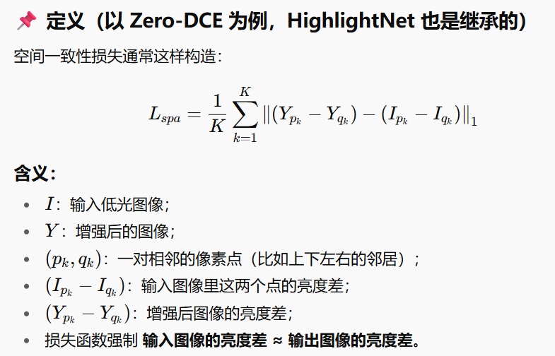

## Ltv — Illumination Smoothness Loss 照明平滑度损失
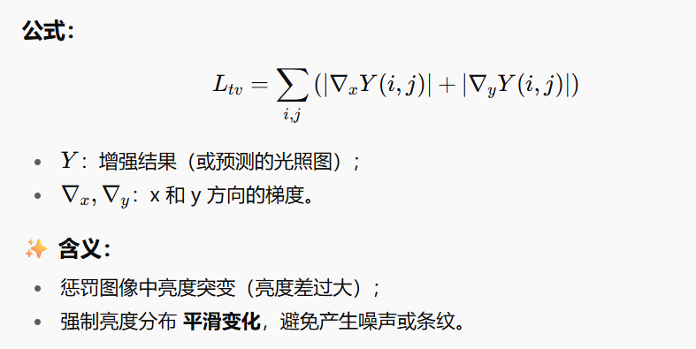

## 交叉熵
交叉熵是二分类常用的损失函数
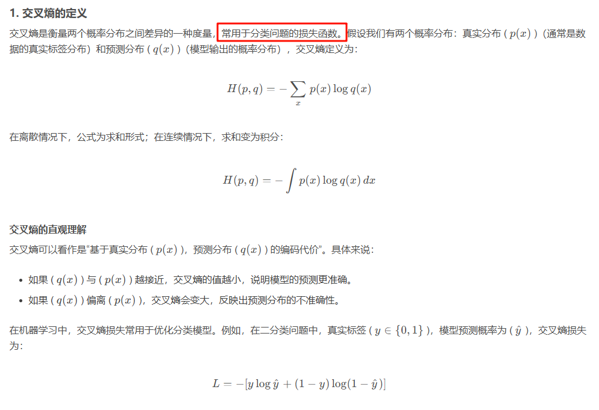

## KL散度
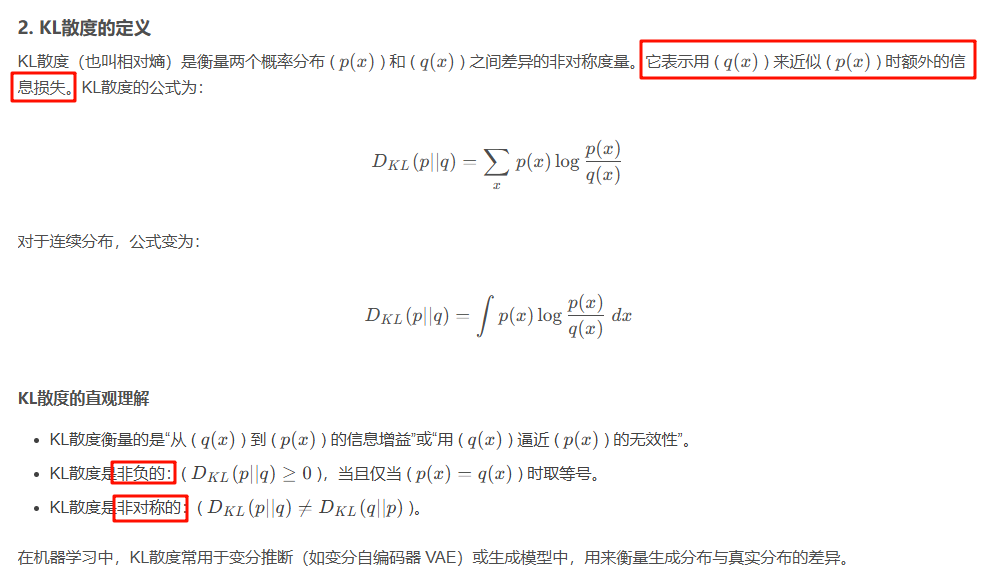

# 归一化方法
什么叫归一化  
https://blog.csdn.net/Next_SummerAgain/article/details/127321209

## Min-Max 归一化（Min-Max Normalization）
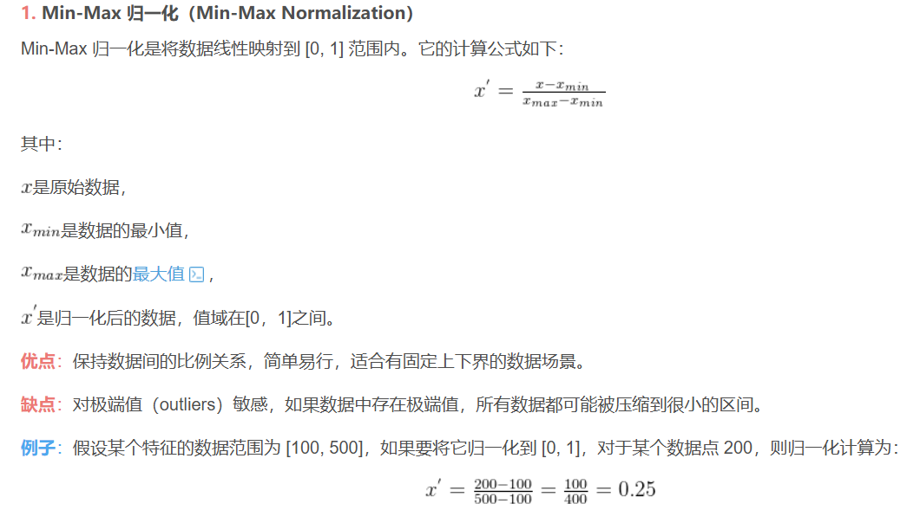
##  Z-score 归一化（标准化，Z-score Normalization）
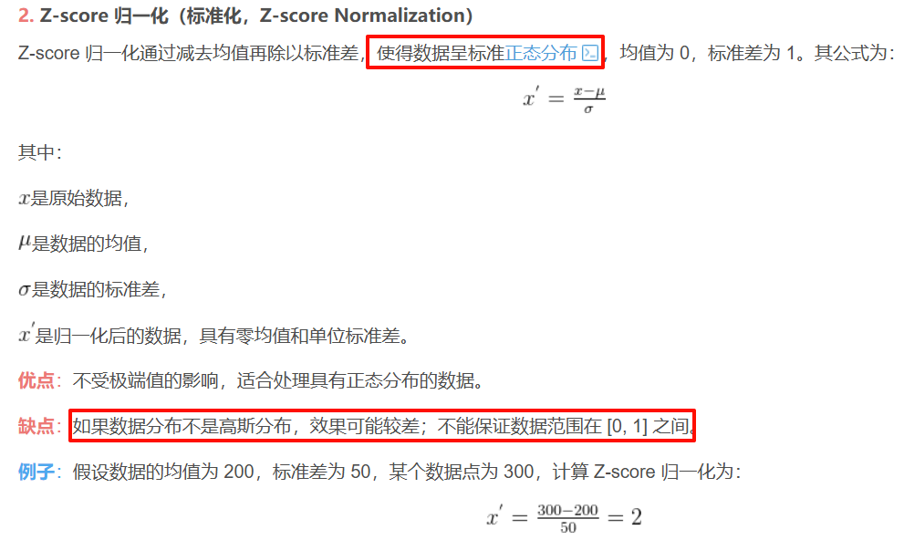
## 最大值归一化（Max Abs Scaling）
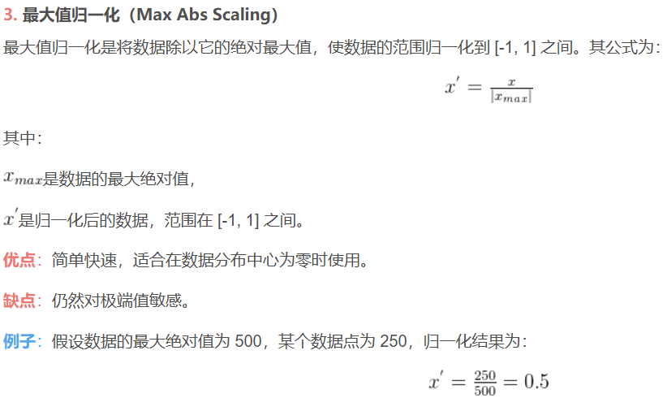
## 小数定标归一化（Decimal Scaling Normalization）
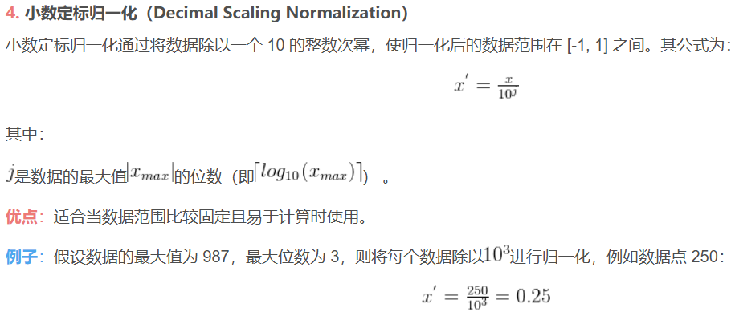
## 向量归一化（Vector Normalization）
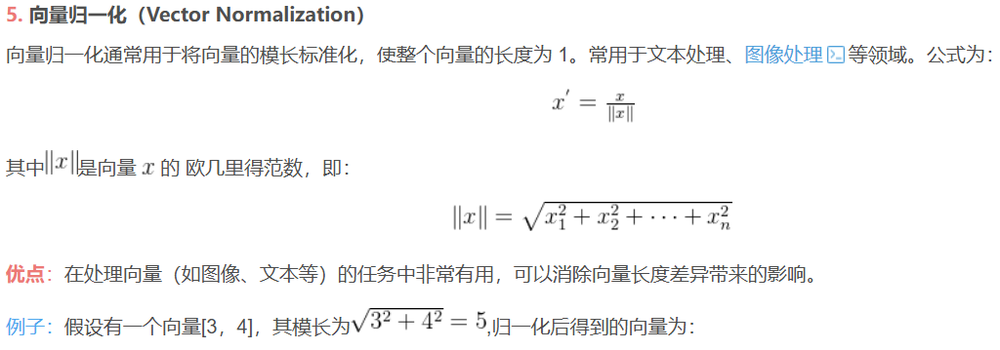
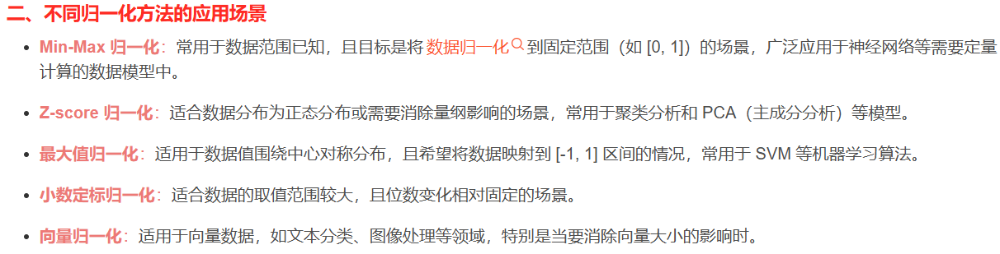
## softmax 
输出值总和为1  范围0-1 完美符合多分类问题
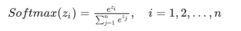
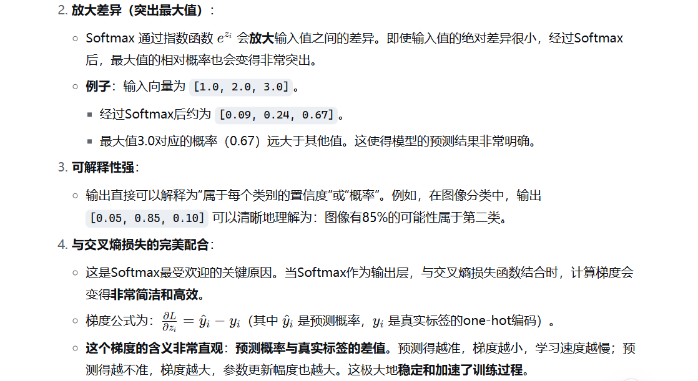

## 计算机视觉常用归一化
BN跨样本、单通道：BN是per-channel的：每个通道独立归一化，有独立的γ、β参数
LN单样本、跨通道：这里单样本是指一张图片
IN：对单个样本 的单个通道所有位置归一化
https://jishuzhan.net/article/1955862523936288769

# 标准化方法

# 激活函数

## SiLU 激活函数(Swish 激活函数)
x*softmax

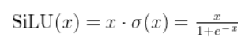
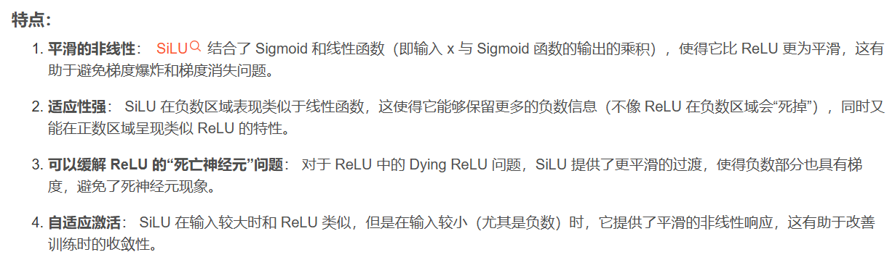
比较
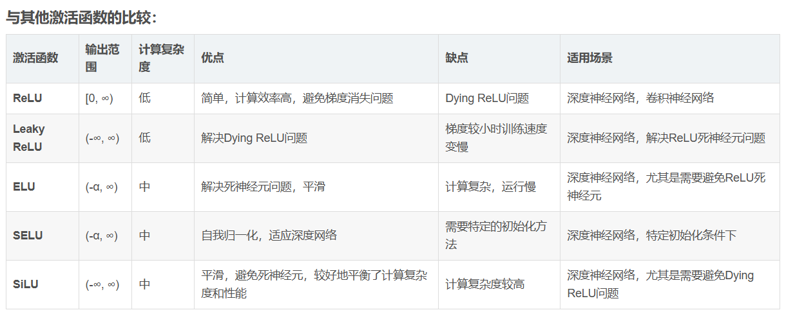

## gelu
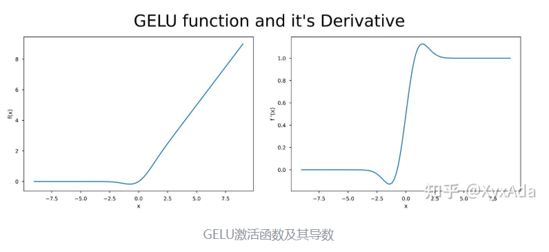
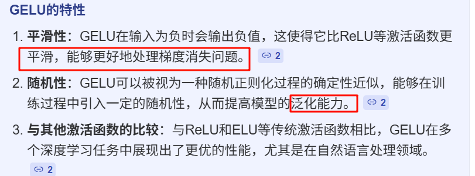