# pythorch学习 许多见代码 pytorch_learn.md
## Tensor类型
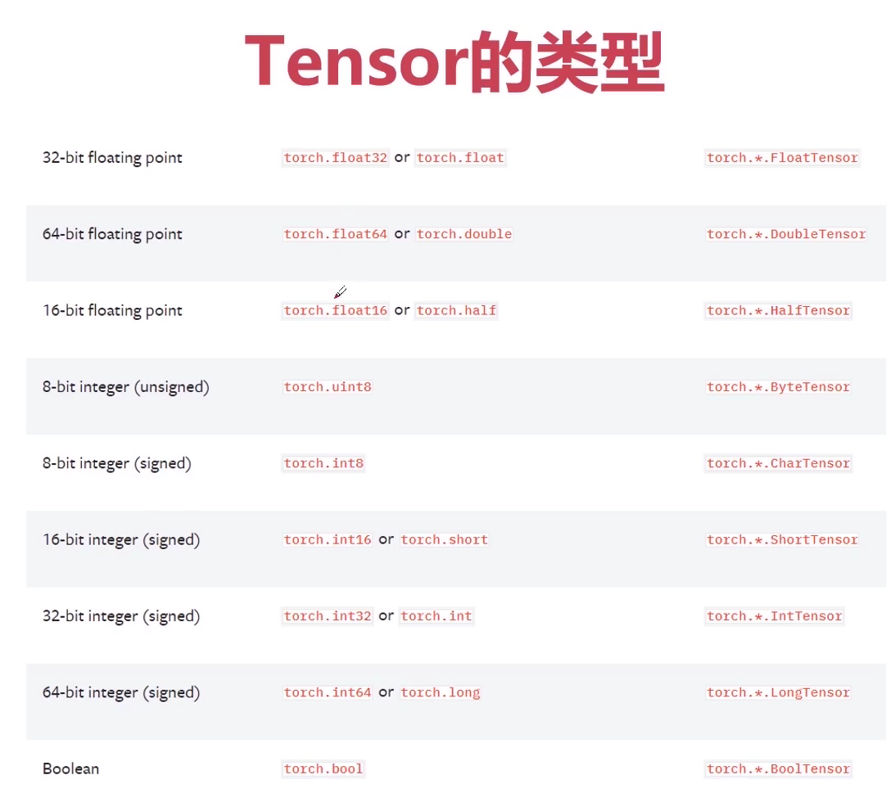
## Tensor创建
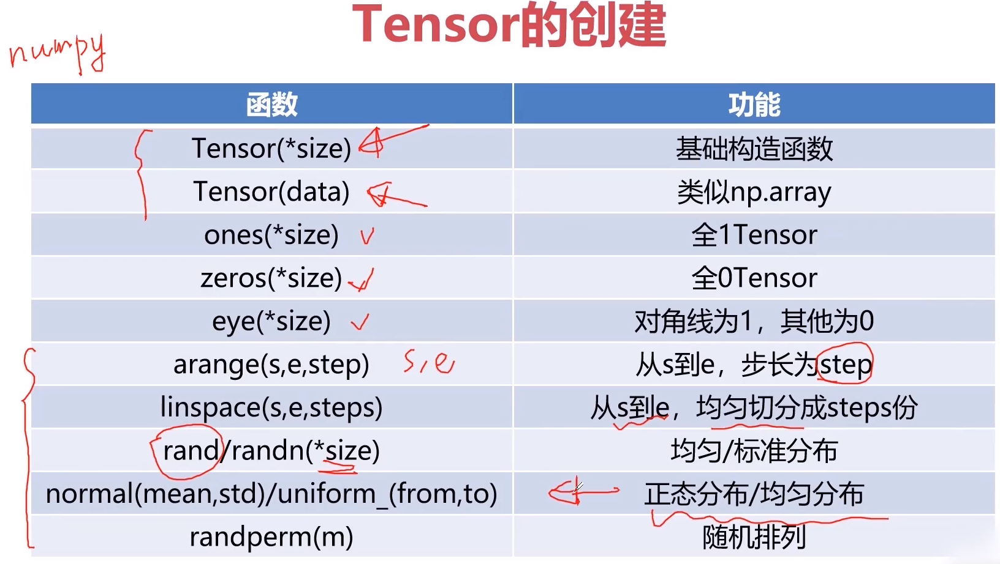
## Tensor属性
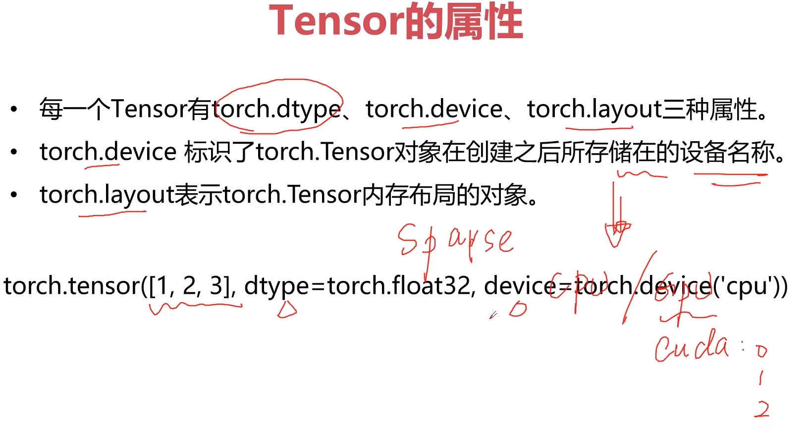
### 稀疏的张量
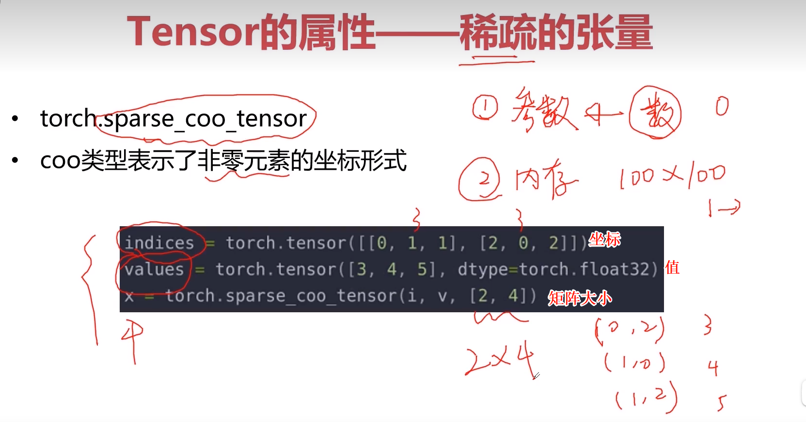
#加 .to_dense()转为稠密张量
##  运算
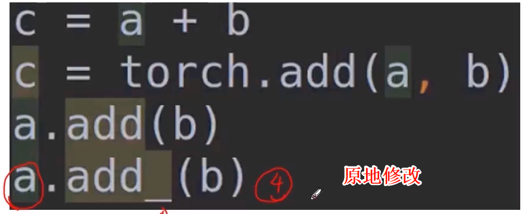

这里就介绍一些没见过的
### * 点乘
对应元素相乘，不论矩阵，数还是向量还是交叉
如果乘一维向量应该是同样一行一行对应元素相乘
### 矩阵乘法
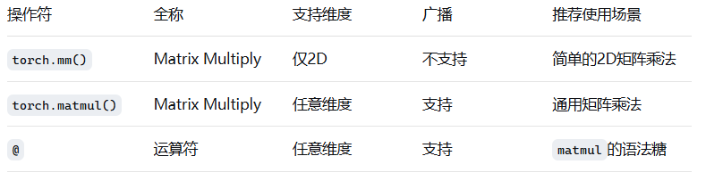
### 幂运算 
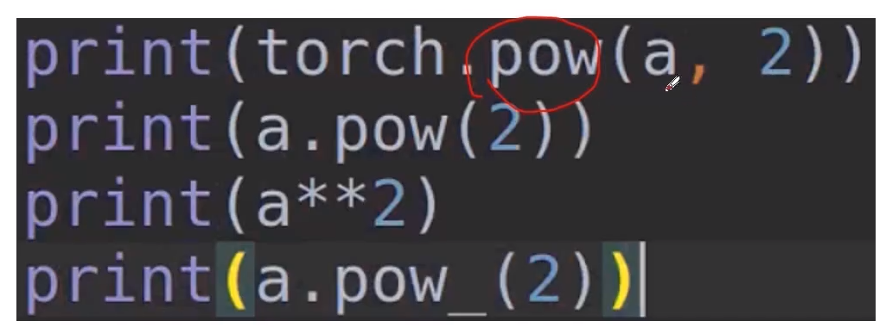

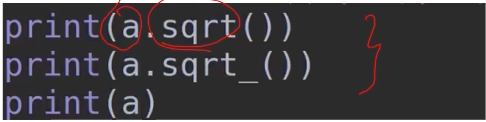

 
## 梯度下降
这里面a就是学习率，使权重向梯度为负方向移动
但是非凸函数容易陷入局部最优，不过深度学习很少有这种
但是深度学习存在鞍点g=0。

一般情况下，损失值是逐渐减小的。  
如果损失值呈现出凹函数，很可能是因为学习率设置的太大  

### 随机梯度下降
对每一个样本计算梯度，进行权重更新，这样随机梯度下降可以有效解决鞍点
实际应用中会每几个一组 batch 每一个batch一次梯度下降
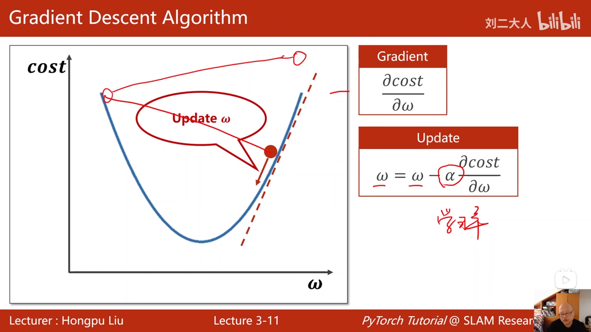 

## 反向传播  这里面会用到链式求导法则 
由于正向传播时，多层的线性变换（矩阵乘法）可以合并为一步矩阵乘法，因此使用非线性变换（激活函数处理）实现“隔开”  
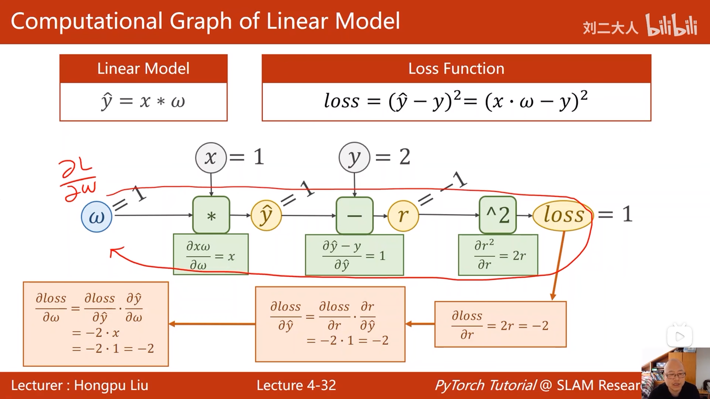

torch中如何使用  
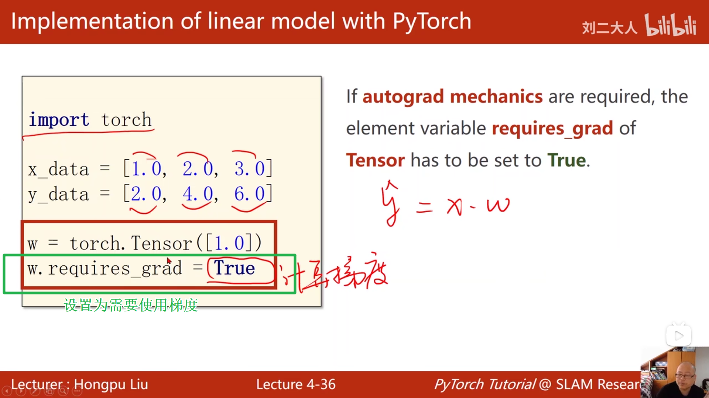
然后用l.backward() 自动的计算梯度，会保存在w.grad  
这里要直接用标量进行操作，因为如果用tensor进行操作容易生成计算图，就类似往后又接了网络，这肯定是错误的。
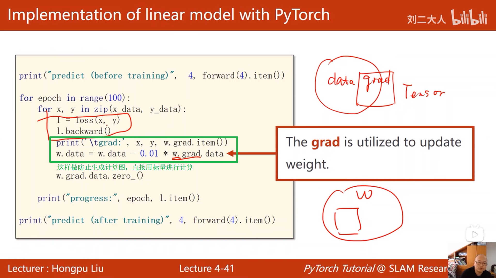
这里在一次运算后还需要对梯度进行清零，不然会梯度累加，除非特意设计
