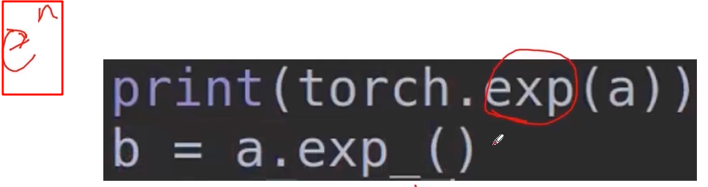
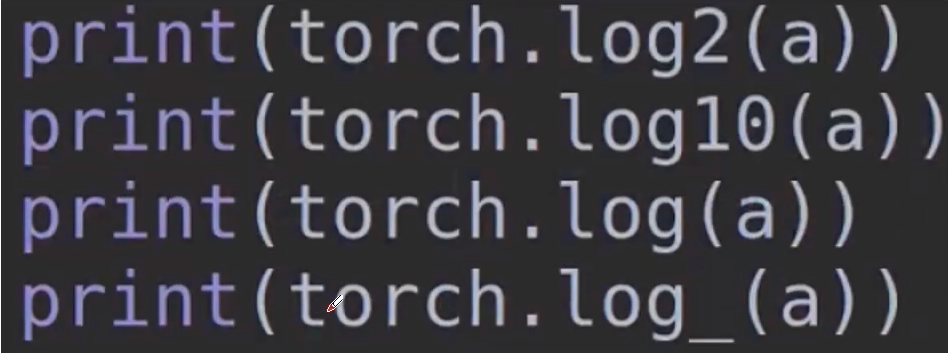

# pythorch学习 许多见代码 pytorch_learn.md
## Tensor类型

## Tensor创建

## Tensor属性

### 稀疏的张量

#加 .to_dense()转为稠密张量
##  运算

这里就介绍一些没见过的
### * 点乘
对应元素相乘，不论矩阵，数还是向量还是交叉
如果乘一维向量应该是同样一行一行对应元素相乘
### 矩阵乘法

### 幂运算

